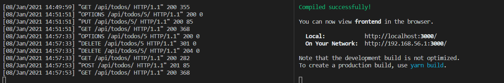
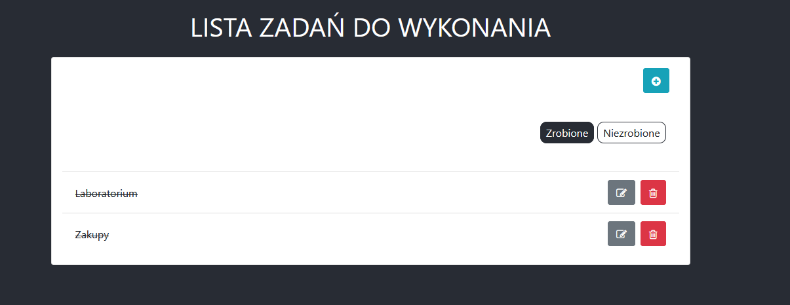
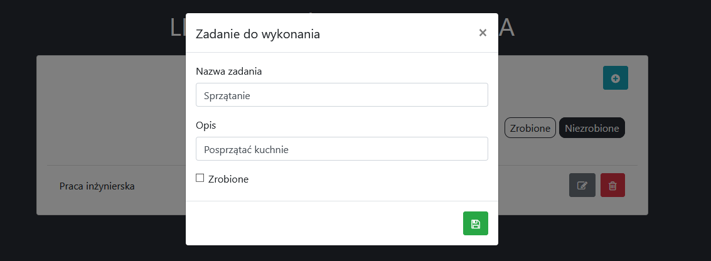
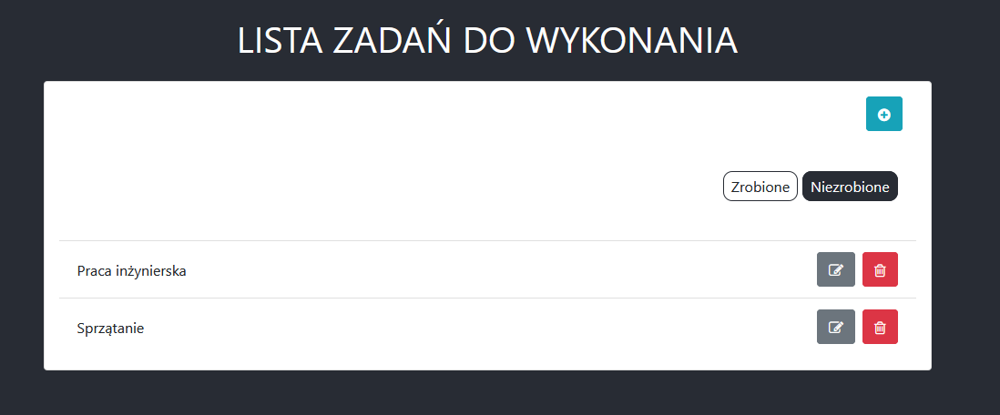

# Laboratorium numer 10

Laboratorium miało na celu napisanie aplikacji tybu ToDo z backendem zrealizowanym w Django oraz frontendem zrealizowanym za pomocą React.js.

W ramach realizacji zadania przeanalizowano, wdrożono oraz delikatnie zmodyfikowano kod z [poradnika](https://www.digitalocean.com/community/tutorials/build-a-to-do-application-using-django-and-react).

## Zrealizowana aplikacja:

Backend + frontend:

Zadania zrobione:

Dodawanie zadania: 

Zadania niezrobione:

